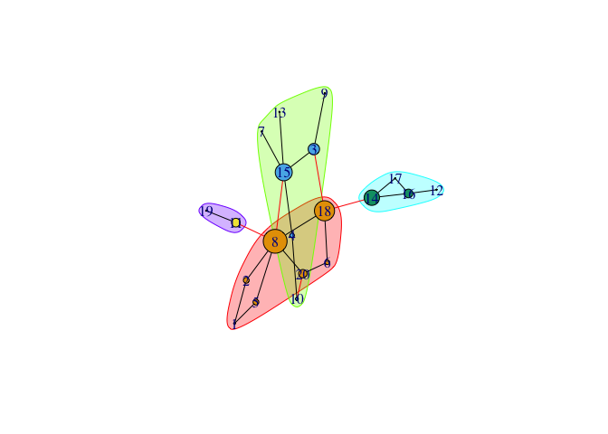

Network Analysis
================
Evan YF W.
2018-05-30

### Use the file gamers.csv to compute the betweenness centrality of the different vertices.

``` r
g <- graph_from_data_frame(gamers,
                           directed = FALSE)
plot(g)
```


``` r
betweenness(g)
```

    ##         1         2         5         3         4         8         7 
    ##  0.500000  8.500000  8.500000 29.000000  5.000000 97.833333  0.000000 
    ##        13        14         6        10        12        16        19 
    ##  0.000000 48.000000  5.666667  2.000000  0.000000 18.000000  0.000000 
    ##         9        11        15        17        18        20 
    ##  0.000000 18.000000 56.666667  0.000000 74.333333 17.000000

### Then use edge betweenness algorithm for community detection and plot the resulting network

#### 1. graph showing the different communities.

#### 2. The size of the vertices in your plot should be proportional to their betweenness centrality score.

``` r
ebc <- edge.betweenness.community(g)
plot(ebc,
     g,
     vertex.size = (betweenness(g)^0.65)+1)
```



### Use the Forrest Gump dataset in the file ForestGump.csv, make a plot of the ego graph for Lieutenant Dan Taylor

### (vertex name "LT DAN" in the data set) of order 1 (i.e., one hop) and compute the edge density of the resulting ego graph.

``` r
g2 <- graph.edgelist(as.matrix(fg),directed = FALSE)

g3 <- make_ego_graph(g2,1,"LT DAN",mode = c("all"))

plot(g3[[1]])
```


### Practice 3

#### Use the file club.csv to compute the average path length for the network graph.

``` r
g3 <- graph_from_data_frame(club,directed =  FALSE)

mean_distance(g3)
```

    ## [1] 3.963218

### Create 1000 random graphs with the same number of vertices and similar edge density.

``` r
g_list <- vector("list",1000)

for(i in 1:1000){
  g_list[[i]] <- erdos.renyi.game(n = gorder(g3), 
                              p.or.m = edge_density(g3), 
                              type = "gnp")
}
head(g_list)
```

    ## [[1]]
    ## IGRAPH 742f4d3 U--- 30 37 -- Erdos renyi (gnp) graph
    ## + attr: name (g/c), type (g/c), loops (g/l), p (g/n)
    ## + edges from 742f4d3:
    ##  [1]  2-- 8  8--11  4--12  7--13  3--15 10--15  4--16 10--16 13--16  2--17
    ## [11]  4--17  9--17 10--17  9--18 17--18 13--19  7--20  1--22  2--23  7--23
    ## [21]  8--23  9--23 20--23  2--24 19--25 22--25 12--26 20--26 26--27  4--29
    ## [31]  9--29 11--29 16--29 25--29  5--30  7--30 10--30
    ## 
    ## [[2]]
    ## IGRAPH a3e38b2 U--- 30 28 -- Erdos renyi (gnp) graph
    ## + attr: name (g/c), type (g/c), loops (g/l), p (g/n)
    ## + edges from a3e38b2:
    ##  [1]  3-- 4  1-- 8  6--10  1--13  6--14  8--15  9--15  6--16 15--16  3--17
    ## [11]  3--18  4--19  9--19 17--19  1--20 11--20  3--21 18--21 10--23  1--24
    ## [21]  5--24 18--25 21--25  5--26 10--27  6--28 17--29  2--30
    ## 
    ## [[3]]
    ## IGRAPH 44060cd U--- 30 25 -- Erdos renyi (gnp) graph
    ## + attr: name (g/c), type (g/c), loops (g/l), p (g/n)
    ## + edges from 44060cd:
    ##  [1]  5-- 6  4-- 7  8--11  6--12 11--12  1--13  3--14  9--14 10--19 17--19
    ## [11]  4--20  3--22 15--22  6--24  1--25  2--25  3--26  5--26 10--26  5--28
    ## [21] 10--28  5--29 24--29  4--30 20--30
    ## 
    ## [[4]]
    ## IGRAPH f08525b U--- 30 37 -- Erdos renyi (gnp) graph
    ## + attr: name (g/c), type (g/c), loops (g/l), p (g/n)
    ## + edges from f08525b:
    ##  [1]  2-- 3  1-- 5  8-- 9  3--10  1--11  2--15  2--16  8--16 15--18  1--20
    ## [11]  7--20  1--22  7--22 20--22  6--23 11--23 13--23 19--23  2--24  4--24
    ## [21]  7--24 10--24 17--25  4--26 12--26 24--26  9--27 24--27 10--28 11--28
    ## [31] 14--28 10--29  5--30 13--30 16--30 18--30 26--30
    ## 
    ## [[5]]
    ## IGRAPH 913d460 U--- 30 32 -- Erdos renyi (gnp) graph
    ## + attr: name (g/c), type (g/c), loops (g/l), p (g/n)
    ## + edges from 913d460:
    ##  [1]  4-- 7  1-- 8  9--10  5--13  3--15  5--16 11--18  5--19 10--19 11--19
    ## [11]  5--20  2--21  3--21  9--21 17--22  4--23 19--23  6--24 11--24 17--24
    ## [21] 18--24 21--24  1--25  9--25  4--26 18--26 20--26  6--28 25--28  8--29
    ## [31] 21--29 23--30
    ## 
    ## [[6]]
    ## IGRAPH d3e5f13 U--- 30 32 -- Erdos renyi (gnp) graph
    ## + attr: name (g/c), type (g/c), loops (g/l), p (g/n)
    ## + edges from d3e5f13:
    ##  [1]  2-- 3  4--10  8--14  4--15 14--15 11--16  3--17 14--18 15--18  2--20
    ## [11]  5--20 11--21 15--22  1--23  7--24 12--24 13--24 22--24  9--25 10--25
    ## [21] 19--26 20--26 21--27 21--28 24--28 21--29 23--29 26--29  2--30 12--30
    ## [31] 25--30 29--30

### Plot a histogram to show the distribution of the average path lengths in these random graphs

``` r
g3.apls <- unlist(lapply(g_list, mean_distance, directed =  FALSE))

hist(g3.apls,xlim = range(c(2,7)) , breaks = 20)

abline(v = mean_distance(g3), col = "red", lty = 3, lwd = 2)
```


### Calculate the proportion of graphs with an Average Path Length smaller than our Forrest Gump network

``` r
sum(g3.apls < mean_distance(g3, directed = FALSE))/1000
```

    ## [1] 0.861
