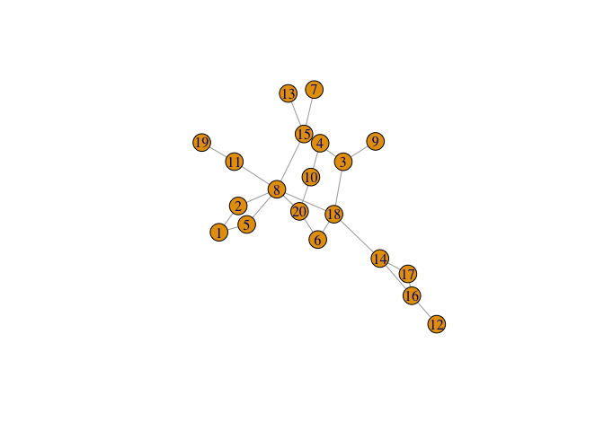
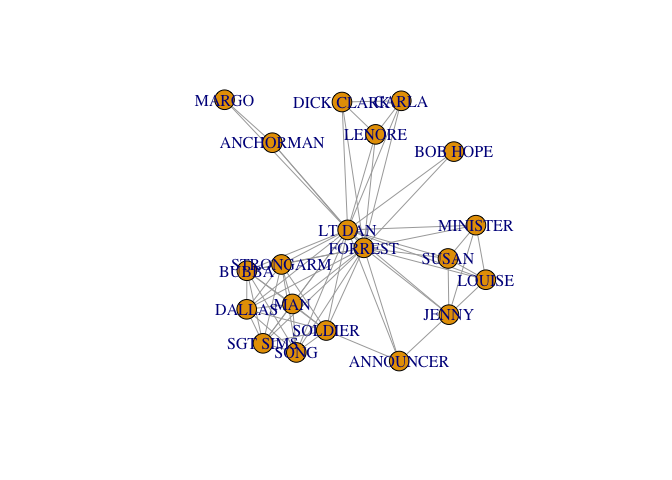
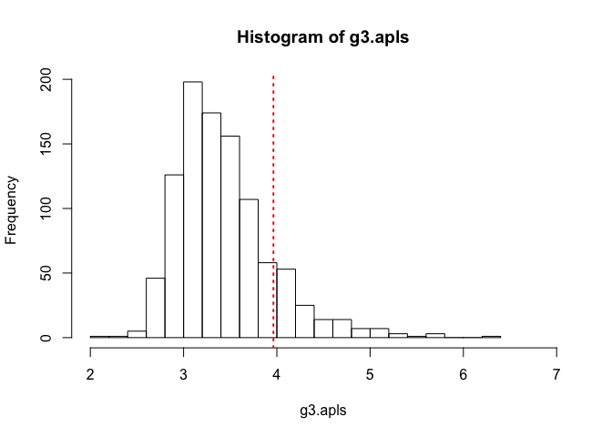

Network Analysis
================
Evan YF W.
2018-05-30

### Use the file gamers.csv to compute the betweenness centrality of the different vertices.

``` r
g <- graph_from_data_frame(gamers,
                           directed = FALSE)
plot(g)
```



``` r
betweenness(g)
```

    ##         1         2         5         3         4         8         7 
    ##  0.500000  8.500000  8.500000 29.000000  5.000000 97.833333  0.000000 
    ##        13        14         6        10        12        16        19 
    ##  0.000000 48.000000  5.666667  2.000000  0.000000 18.000000  0.000000 
    ##         9        11        15        17        18        20 
    ##  0.000000 18.000000 56.666667  0.000000 74.333333 17.000000

### Then use edge betweenness algorithm for community detection and plot the resulting network

#### 1. graph showing the different communities.

#### 2. The size of the vertices in your plot should be proportional to their betweenness centrality score.

``` r
ebc <- edge.betweenness.community(g)
plot(ebc,
     g,
     vertex.size = (betweenness(g)^0.65)+1)
```


### Use the Forrest Gump dataset in the file ForestGump.csv, make a plot of the ego graph for Lieutenant Dan Taylor

### (vertex name "LT DAN" in the data set) of order 1 (i.e., one hop) and compute the edge density of the resulting ego graph.

``` r
g2 <- graph.edgelist(as.matrix(fg),directed = FALSE)

g3 <- make_ego_graph(g2,1,"LT DAN",mode = c("all"))

plot(g3[[1]])
```



### Practice 3

#### Use the file club.csv to compute the average path length for the network graph.

``` r
g3 <- graph_from_data_frame(club,directed =  FALSE)

mean_distance(g3)
```

    ## [1] 3.963218

### Create 1000 random graphs with the same number of vertices and similar edge density.

``` r
g_list <- vector("list",1000)

for(i in 1:1000){
  g_list[[i]] <- erdos.renyi.game(n = gorder(g3), 
                              p.or.m = edge_density(g3), 
                              type = "gnp")
}
```

### Plot a histogram to show the distribution of the average path lengths in these random graphs

``` r
g3.apls <- unlist(lapply(g_list, mean_distance, directed =  FALSE))

hist(g3.apls,xlim = range(c(2,7)) , breaks = 20)

abline(v = mean_distance(g3), col = "red", lty = 3, lwd = 2)
```



### Calculate the proportion of graphs with an Average Path Length smaller than our Forrest Gump network

``` r
sum(g3.apls < mean_distance(g3, directed = FALSE))/1000
```

    ## [1] 0.864
